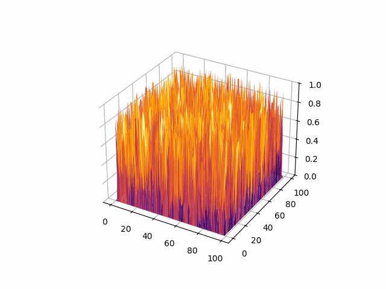
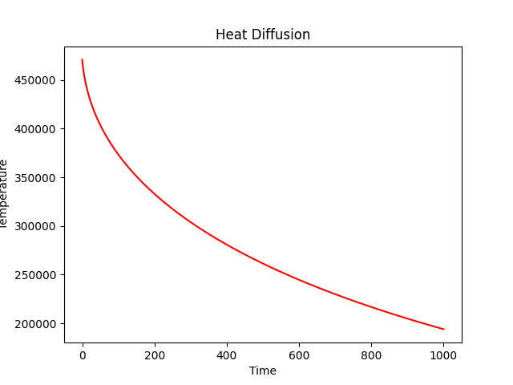
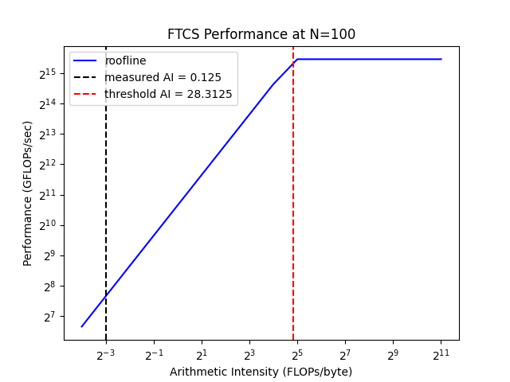
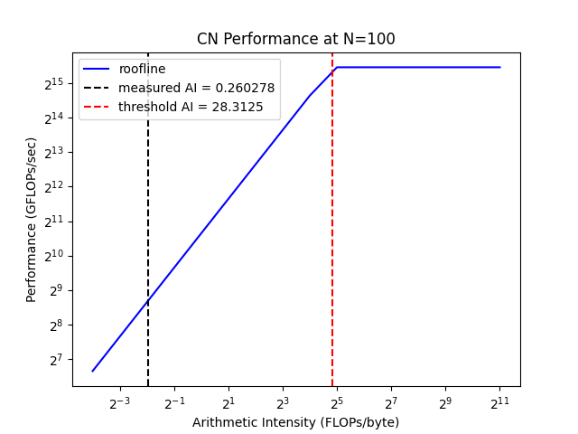
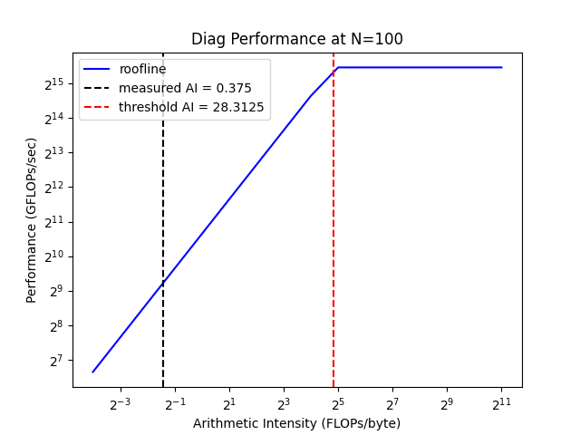

# Thermosolver

A parallelized C++ program that simulates heat diffusion.



## Table of Contents

* [Overview](#overview)
* [Requirements](#requirements)
* [Build](#build)
* [Usage](#usage)
* [Background](#background)
  * [Forward Time-Centered Space (FTCS)](#forward-time-centered-space-ftcs)
  * [Crank-Nicolson](#crank-nicolson)
  * [Red-Black Gauss-Seidel (RBGS)](#red-black-gauss-seidel-rbgs)
* [Parallelization](#parallelization)
  * [Reduction](#reduction)
    * [OpenMP](#openmp)
    * [GPU](#gpu)
* [Results](#results)
  * [Roofline](#roofline)

## Overview

This program numerically solves the three-dimensional heat equation partial differential equation using the Forward Time-Centered Space (FTCS) and Crank-Nicolson methods.

This repository hosts two parallelized implementations of the project. The first version uses OpenMP compiler directives whereas the second offloads computations to AMD GPUs using the HIP API.

The Python script `plotter.py` was used to generate the plots in this README.

## Requirements

The core of the program is written in C++. The project is built with [CMake](https://cmake.org).

All versions require [OpenMP](https://www.openmp.org), an API which enables shared-memory parallelism on the CPU. It is available on most common C/C++ compilers such as GCC (which was used to compile this program) and Clang. You can enable it by invoking the `-fopenmp` flag during compilation.

The versions on the `main` and `hip` branches depend on [HIP](https://rocm.docs.amd.com/projects/HIP/en/latest/index.html). Similar to NVIDIA's CUDA, HIP is a parallel programming interface which enables multithreading on GPUs, but unlike CUDA, it is compatible with both NVIDIA and AMD GPUs.

Additionally, the plotter script requires [Matplotlib](https://matplotlib.org) and [NumPy](https://numpy.org) to build its plots.

## Build

Once everything is installed, you can use the presets defined in `CMakePresets.json`, which lists all of the necessary build configurations. To get started, first navigate to the project directory in your terminal. You can checkout and build the OpenMP version from the `omp` branch with the GCC/G++ preset.

```bash
cmake --preset gcc-preset
cmake --build --preset gcc-preset 
```

For the versions in the `main` and `hip` branches, use the HIP preset:

```bash
cmake --preset hip-preset
cmake --build --preset hip-preset
```

## Usage

The program can be (and mainly is) run as a SLURM job on supercomputers. Refer to the `job.sh` script, which can be invoked as:

```bash
sbatch job.sh
```

You can check the run status with:

```bash
squeue -u [username]
```

Make sure to edit the arguments passed to the executable in `job.sh` using the following guidelines:

```bash
Usage:
    ./build/main.exe METHOD DIM STEPS [HEATMAP] [DIAG] [PERF]

Arguments:
    METHOD      Solver method (0 = FTCS, 1 = CN)
    DIM         Grid size (>= 5, multiple of 5)
    STEPS       Number of time steps (>= 1)

Optional Arguments:
    HEATMAP     Toggle heatmap logging (optional, 0 = false, non-zero value = true)
    DIAG        Toggle diagnostics logging (optional, 0 = false, non-zero value = true)
    PERF        Toggle performance logging (optional, 0 = false, non-zero value = true)
```

The first three arguments are mandatory, the last three are optional.

Heatmap logging will print out at most 100 frames of a 2D slice of the grid to `heat_data.dat`.

Diagnostics logging exports an overview of the heat system at each time step to `diag_data.csv`.

Performance logging exports performance stats of the solver to `ftcs_perf.csv` or `cn_perf.csv` depending on the method used (and diagnostics to `diag_perf.csv` if enabled).

## Background

### Forward Time-Centered Space (FTCS)

Consider the 1D heat equation:

$$
\frac{\partial u(x,t)}{\partial t} = \alpha \cdot \frac{\partial^2 u(x,t)}{\partial^2 x}
$$

where $t$ represents time, $x$ represents a position on the affected material, $u$ represents the temperature at position $x$ and time $t$, and $\alpha$ represents the thermal diffusivity of the affected material. This solver assumes that the material is rubber, which has a diffusivity of $\alpha=1.3\times10^{-7}m^2/s$.

It states that the derivative of $u$ with respect to $t$ is equal to the twice-differentiated derivative of $u$ with respect to $x$ times a given coefficient $\alpha$.

A 3D extension of the equation would look like this:

$$
\frac{\partial u(x,y,z,t)}{\partial t} = \alpha \cdot (\frac{\partial^2 u}{\partial^2 x} + \frac{\partial^2 u}{\partial^2 y}+ \frac{\partial^2 u}{\partial^2 z})
$$

The goal is to solve for the temperature at time $t$ at position $(x,y,z)$.

We need to convert the equation's inputs from a continuous to a discrete format, and define boundary conditions for the domain. Since the solver is working in a closed system where no energy being added to it, the heat will decrease over time to 0, so the boundary conditions (i.e. the edges of the discrete grid of values) would be set to 0.

The sum of the second-order partial derivatives on the right-hand side of the equation is also known as the Laplacian. This program uses the finite differences method to numerically derive the Laplacian's result. The 1D version of that looks like this:

$$
\frac{\partial^2 u}{\partial^2 x} = \frac{u(x-\Delta x) - 2u(x) + u(x+\Delta x)}{\Delta x \cdot \Delta x}
$$

where $\Delta x$ is the distance between two points in the discretized representation of the continuous domain, which in the solver's case is $[0,1]$.

That takes care of the spatial aspect, but the temporal part of the equation also needs to be solved. This program uses the Forward Euler method of numerical integration to do just that. The 1D version of the Forward Euler method uses the following formula to solve a given function $u$ at position $x$ for time $t+1$:

$$
u^{t+1}_x = u^t_x + \Delta t \cdot u(x,t)
$$

Replacing $u(x,t)$ with the discretized form of the heat equation's right-hand side (RHS) and assuming $\Delta x=\Delta y=\Delta z$ (i.e. the grid is a cube), we get this discretized update formula:

$$
u^{t+1}_{x,y,z} = u^t_{x,y,z} + \Delta t \cdot [\alpha \cdot \frac{u^t_{x-\Delta x,y,z} + u^t_{x+\Delta x,y,z} + u^t_{x,y-\Delta y,z} + u^t_{x,y+\Delta y,z} + u^t_{x,y,z-\Delta z} + u^t_{x,y,z+\Delta z} - 6u^t_{x,y,z}}{\Delta x \cdot \Delta x}]
$$

This combination of Forward Euler integration and finite differences is also known as the __Forward Time-Centered Space (FTCS)__ method.

FTCS is known as an explicit method because it computes results from only known values, but this has its drawbacks. One such issue is its poor stability, which means it will provide incorrect outputs unless a certain rule is satisfied.

This rule states that the temporal stride must be less than or equal to the spatial stride. In other words, time cannot outstrip space. This rule is called the Courant-Friedrichs-Lewy (CFL) condition, and it forces FTCS to take very small timesteps which results in multiple computations just to simulate one second of spatial evolution. So is there a way around this?

### Crank-Nicolson

A numerical method can be considered implicit if it uses known and unknown values to compute results. One example of such implicit techniques is the Backward Euler method, whose formula is shown below:

$$
u^{t+1}_x = u^t_x + \Delta t \cdot u(x,t+1)
$$

A glaring oddity of this method is the $t+1$ expression on the RHS; how can one know the state of the system ahead of time? To resolve this, the terms can be rearranged such that the RHS consists of only known values. This would form a linear system of equations, which would require another iterative method to converge to a solution.

A more accurate solution for the heat equation can be derived by averaging the $u(x,t)$ and $u(x,t+1)$ terms from the Forward Euler and Backward Euler methods, and using that average in place of $u(x,t)$ in the FTCS formula. The 1D version of that looks like this:

$$
u^{t+1}_x = u^t_x + \Delta t \cdot \frac{u(x,t) + u(x,t+1)}{2}
$$

This is known as the __Crank-Nicolson__ method.

The discretized 3D version of Crank-Nicolson would show that the $u^{t+1}_{x,y,z}$ variable (which is being solved for) would be found on both sides of the equation. This variable must be gathered and shifted over to the left-hand side to prevent multiple threads from updating it at the same time during the iterations, in what is known as a _race condition_.

Crank-Nicolson is great because it is a stable method, and so does not need to enforce the CFL condition. This means that the solver can handle larger timesteps, which in turn allows for longer simulations and better guarantees of acceptable results.

### Red-Black Gauss-Seidel (RBGS)

Now the fact remains that an iterative solution is needed to know the values of $u$ at $t+1$. The solver uses the __Red-Black Gauss-Seidel (RBGS)__ method for that purpose, a parallel-friendly iterative technique which utilizes the latest updated values in the grid to update the upcoming ones, but it is done in a two-pass checkerboard pattern to avoid race conditions. The first pass handles the red grid cells, and the second pass handles the black grid cells, hence the name.

These linear solving iterations continue until the maximum absolute difference of grid values from the past and present iteration indicate convergence to a settled solution. This would occur at each time step, a computationally expensive process.

## Parallelization

We can parallelize the solver by invoking OpenMP directives at hotspots in the code. The main hotspots are the triple nested for loops that iterate through the grid to interact with each grid cells for initialization, diagnostics, etc. One such recurring directive is `#pragma omp parallel for`. This essentially launches a swarm of threads that would each work on a different part of the grid at the same time.

OpenMP is meant to be used with CPUs and launches a limited number of threads, but GPUs 10x more threads available to put to work. Using HIP, the code contains GPU versions of the serial functions called _kernels_, which would define a single GPU thread's instructions.

### Reduction

There are times when the solver needs to aggregate values across the grid for many reasons such as diagnostics or deciding on whether to continue RBGS iterations or not. Such aggregation is called _reduction_. Reduction is very finicky while parallelizing due to race conditions between threads trying to update the variable storing the reduction result.

### OpenMP

For OpenMP, it's simple enough: just add a clause to the directive describing the variable that will store the aggregated value and the aggregating operation. For example, `#pragma omp parallel for reduction(+:total)` means that the variable `total` will contain the sum of all values in the grid.

### GPU

For GPUs, it gets a bit more involved. The solver takes advantage of the way threads are organized on GPUs.

On AMD chips, threads are arranged into groups of 64 called wavefronts. On NVIDIA chips, the groups are called warps and are consist of 32 threads. For consistency, this README will refer to such thread groupings as warps. Warps make up a thread block, thread blocks make up a grid.

Threads in a warp share a memory register, enabling fast memory operations. Each thread hosts a grid value, then those values can be aggregated across the warp. The first thread of each warp will host the result. These are called _shuffle operations_.

The first thread in each warp would store the warp-level result in a special array managed by the current thread block. The first thread in the block then aggregates the warp-level results to get a block-level result. Finally, the kernel invokes an atomic operation to get the aggregate across thread blocks.

Kudos if you followed all of that.

## Results

This plot displays the general decrease of temperature across the grid as the heat diffuses over 1000 timesteps, which has been normalized to range from 0 to 1 for each randomly initialized grid point. FTCS was used to generate this data due to its quick simulation of runs with a low number of timesteps.



Below is a table of runtime durations for FTCS and Crank-Nicolson over 1000 timesteps on a randomly initialized grid:

| FTCS Implementation | $N=100$ (in sec) | $N=200$ (in sec) |
| :----------------- | :--------------: | :--------------: |
| Serial | 0.781 | 7.086 |
| OpenMP | 0.133 | 2.139 |
| HIP | 0.042 | 0.193 |

| Crank-Nicolson Implementation | $N=100$ (in sec) | $N=200$ (in sec) |
| :----------------- | :--------------: | :--------------: |
| Serial | 22.726 | 185.821 |
| OpenMP | 1.720 | 20.679 |
| HIP | 0.606 | 3.653 |

This OpenMP implementation of FTCS provides considerable speedups by a factor of ~3x from the serial version. What should be noted is that the computational effort for Crank-Nicolson is  much more intensive since a subset of RBGS iterations is done at each timestep. That is why the most dramatic improvement can be seen in the HIP implementation of Crank-Nicolson where a __50x__ speedup is observed for a grid size of $200^3$. In other words, that cuts a 3 minute wait down to 3 seconds.

### Roofline

For the roofline analysis, all runs were performed for 1000 timesteps on a grid size of $100^3$ using an AMD MI210 GPU with a peak FP64 (double-precision) flop rate of 45.3 TFLOPs and a peak bandwidth of 1.6 TB/sec.

To preface this, stencil-based solvers like Thermosolver are usually memory-bound, meaning that higher performance is held back by the number of bytes moved during each kernel launch.

Both the serial and OMP versions of FTCS and Crank-Nicolson have arithmetic intensities (AI) of 0.125 and 0.15 respectively. The higher AI for the latter can be attributed to the RBGS iterations for each timestep.

Below is a comparison of the FTCS and Crank-Nicolson roofline models in the HIP implementation.

| FTCS | Crank-Nicolson |
| :--: | :------------: |
|  |  |

After GPU offloading, FTCS still retains an AI of 0.125 since the kernel is monolithic, i.e. each GPU thread has a one-to-one mapping with each grid point, so the bytes moved and flops scale up proportionally.

However, Crank-Nicolson includes GPU reductions, and so the AI for the implementation is influenced by the number of RBGS iterations (which requires two kernel launches to complete one pass) and the number of threads launched since all threads take part in the reduction process. This results in a higher AI than that of FTCS.

Observing the diagnostics kernel's performance, the three reductions for the minimum temperature, maximum temperature, and sum of all temperatures take center stage in computations, since it is roughly 1 memory loading operation for every 3 FLOPs per grid cell. Accounting for the GPU computations, it results in the highest AI from all 3 kernels (FTCS, Crank-Nicolson, and diagnostics), clocking in around ~2 at varying grid sizes.


